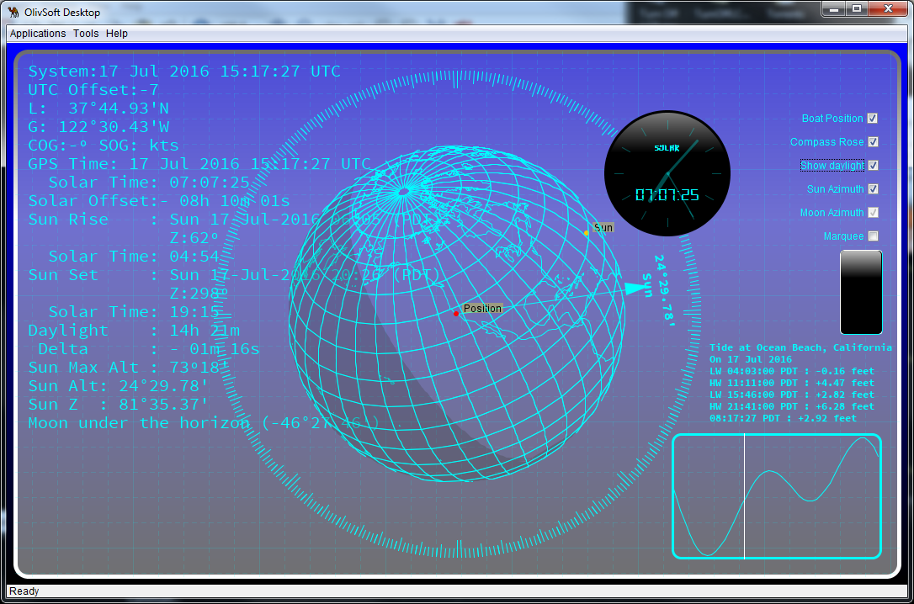
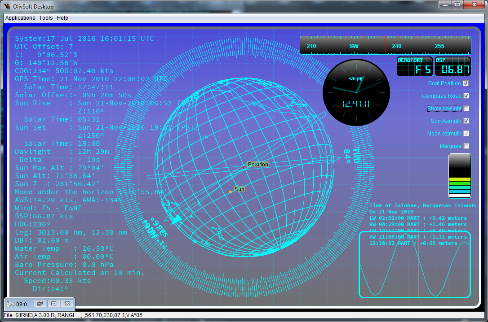
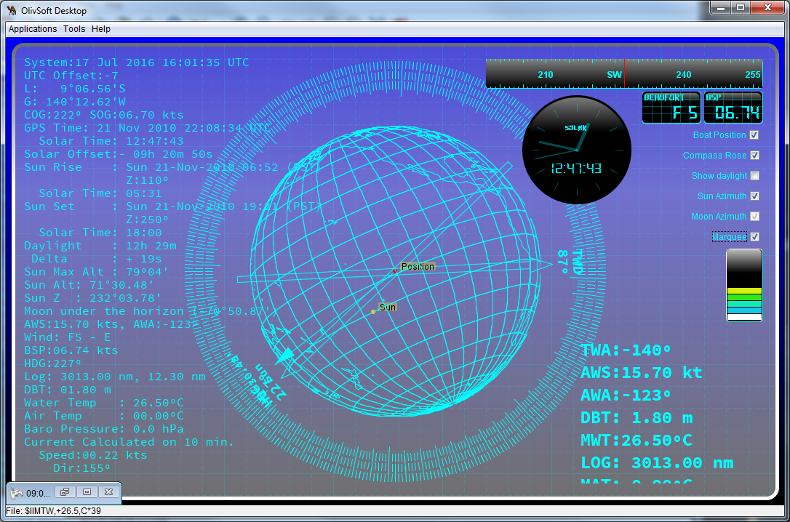

## Navigation Console
This project gathers many different satellites, in one place. All of them can be  built from the same place.

Its documentation can be found [here](https://drive.google.com/drive/folders/0B1OXF1qWHj9mZFZxUkV1cUZFblk), even it is not 100% in sync with the soft, it will give you a
good idea of what it does.

### Live Wallpaper (July 2016)
You can now use the live wallpaper even if you are not connected to an NMEA Station (like ashore).
Just give your position in a specific preference, and you are good to go.

Sun and Moon positions are plotted when visible.

No NMEA Data. Displays the closest tide station (within a 100nm radius)

With NMEA Data. Displays the closest tide station (within a 100nm radius)

With NMEA Data. With Marquee.

